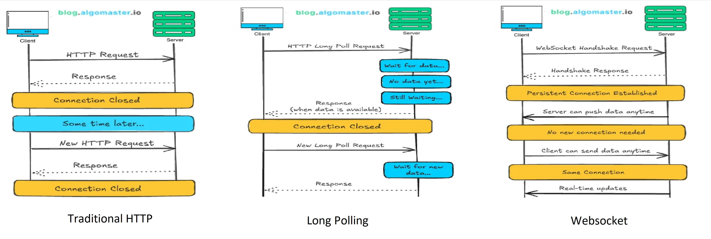
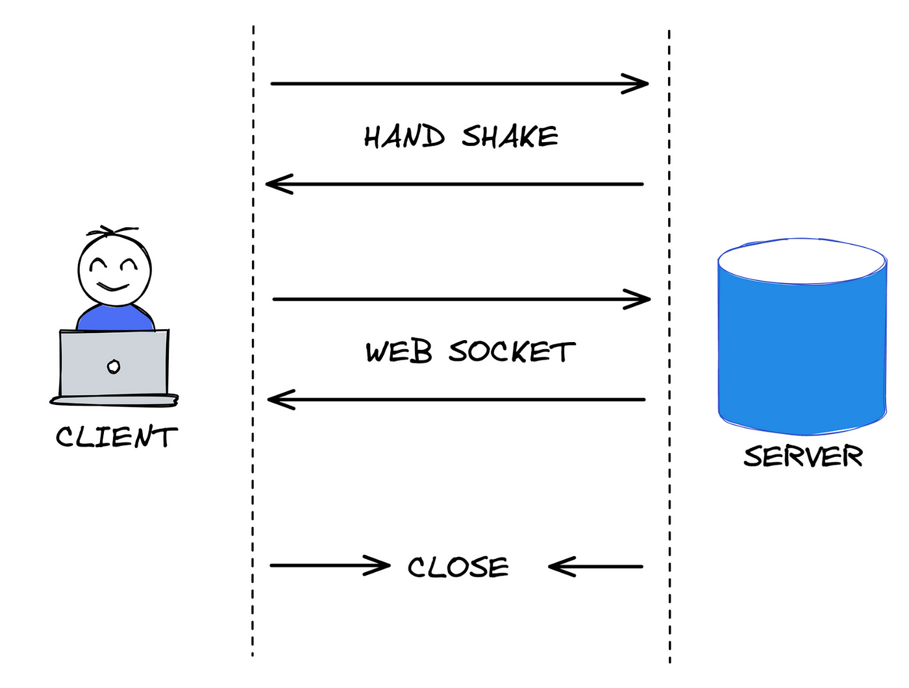

## Ứng dụng chat sử dụng SocketIO


## SocketIO là gì?
**Socket.IO** là thư viện giúp xây dựng **ứng dụng real-time** (hoạt động theo thời gian thực) giữa client (trình duyệt, app) và server. Nó cho phép hai bên trao đổi dữ liệu **tức thì** mà không cần client phải liên tục gửi yêu cầu (request) như cách HTTP truyền thống.

**Vậy ứng dụng real-time là gì? Ví dụ thực tế:**
- Khi bạn dùng **Facebook Messenger**, tin nhắn xuất hiện ngay lập tức khi đối phương gửi → Đây là real-time.
- Trò chơi online như Liên Quân, bạn thấy đồng đội di chuyển ngay lập tức → Cần kết nối real-time.
- Khi bạn xem **live-stream** trên Youtube, các comment của người xem cũng được hiển thị real-time.

## Các phương thức truyền dữ liệu giữa client và server



### 1. Traditional HTTP 

Cách hoạt động:
- Client (browser, mobile app) gửi request tới server
- Server xử lý request và gửi lại response
- Đóng kết nối.

**Ưu điểm:** Đơn giản, phổ biến, phù hợp cho ứng dụng không cần real-time

**Nhược điểm:** Không hỗ trợ truyền dữ liệu tức thì từ server đến client.

### 2. Long Polling
      
Cách hoạt động:
- Client gửi request đến server
- Server giữ request (không trả lời ngay). Khi có dữ liệu mới, server trả response cho client
- Client nhận response xong gửi request mới ngay.

**Ưu điểm:** Giảm độ trễ so với traditional HTTP
     
**Nhược điểm:** Tốn tài nguyên server do phải giữ nhiều kết nối, độ trễ vẫn có.

### 3. Websocket

Cách hoạt động:
- Client và server tạo 1 kết nối lâu dài qua thủ tục handshake
- Sau đó cả hai có thể gửi/nhận data real-time cho đến khi 1 trong 2 bên đóng kết nối.
     
**Ưu điểm:**
- Độ trễ cực thấp (do không cần lặp lại thủ tục handshake)
- Ít tốn tài nguyên server hơn Long-Polling vì chỉ có 1 kết nối so với việc lặp lại các HTTP request.

**Nhược điểm:** Phức tạp trong triển khai (yêu cầu Client và Server hỗ trợ Websocket)
     
Do ưu điểm của Long Polling và Websocket nên SocketIO sử dụng 2 phương pháp này để triển khai real-time communication
     
## Các khái niệm chính trong SocketIO
### Events (sự kiện):
- Client/Server có thể “nghe” và “phát” sự kiện (ví dụ các sự kiện như: “message”, “new-user”)
- Ví dụ: `socket.emit('chat-message', data)` và `socket.on('chat-message', callback)`.
### Room & namespaces
- **Room:** Nhóm các kết nối để gửi dữ liệu tập trung (ví dụ: phòng chat).
- **Namespaces:** Tách biệt logic ứng dụng (ví dụ: `/admin`, `/user`).
### Auto-reconnect: 
Tự động kết nối lại nếu bị ngắt kết nối.
### Fallback: 
Kết nối sẽ chuyển sang kiểu HTTP long-polling trong trường hợp không thể thiết lập kết nối WebSocket
     
## Cách SocketIO hoạt động



1. Handshake (Bắt tay) để thiết lập kết nối.
2. Lựa chọn phương thức truyền tải (WebSocket hoặc Long-Polling).
3. Trao đổi dữ liệu qua events.
4. Xử lý ngắt kết nối/reconnect.

## Triển khai cơ bản

### Code server (server.js)
```javascript
const express = require('express');
const http = require('http');
const { Server } = require('socket.io');

// Khởi tạo Express và HTTP server
const app = express();
const server = http.createServer(app);
const io = new Server(server);

// Xử lý kết nối
io.on('connection', (socket) => {
  console.log('Client connected:', socket.id);

  // Nhận tin nhắn từ client
  socket.on('message', (data) => {
    console.log('Received:', data);
    
    // Gửi lại cho tất cả client (broadcast)
    io.emit('message', data);
  });

  // Xử lý ngắt kết nối
  socket.on('disconnect', () => {
    console.log('Client disconnected:', socket.id);
  });
});

// Khởi động server
const PORT = 3000;
server.listen(PORT, () => {
  console.log(`Server running on port ${PORT}`);
});
```

### Android Client (Kotlin)
```kotlin
class MainActivity : AppCompatActivity() {
    private lateinit var mSocket: Socket
    private lateinit var edtMessage: EditText
    private lateinit var tvMessages: TextView
    private lateinit var btnSend: Button

    override fun onCreate(savedInstanceState: Bundle?) {
        super.onCreate(savedInstanceState)
        setContentView(R.layout.activity_main)

        edtMessage = findViewById(R.id.edtMessage)
        tvMessages = findViewById(R.id.tvMessages)
        btnSend = findViewById(R.id.btnSend)

        // Kết nối đến server
        try {
            mSocket = IO.socket("http://10.0.2.2:3000") // Dùng 10.0.2.2 cho emulator
            mSocket.connect()
        } catch (e: Exception) {
            Log.e("SocketIO", "Connection error", e)
        }

        // Lắng nghe sự kiện 'message'
        mSocket.on("message") { args ->
            runOnUiThread {
                val message = args[0] as String
                tvMessages.append("$message\n")
            }
        }

        // Gửi tin nhắn
        btnSend.setOnClickListener {
            val message = edtMessage.text.toString()
            if (message.isNotEmpty()) {
                mSocket.emit("message", message)
                edtMessage.text.clear()
            }
        }
    }

    override fun onDestroy() {
        super.onDestroy()
        if (::mSocket.isInitialized) {
            mSocket.disconnect() // Ngắt kết nối khi hủy Activity
        }
    }
}

```